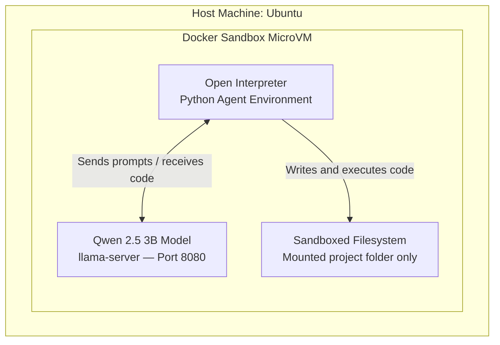

<p align="center">
  
  
</p>

# Local AI Agent inside a Docker Sandbox

Just a day ago at the **WeAreDevelopers** conference, Docker announced their brand new **Docker Sandboxes** (v3 MicroVMs) designed specifically for AI agents. I wanted to try it out immediately, so here is how I built a fully autonomous AI agent using the new sandbox combined with a local, open-weights Qwen model. 

The goal of this project is to create an agent that can write and execute code while remaining safely isolated from the host machine.

## The Architecture

To build a fully functional, safe agent, this project combines three specific technologies:

1. **The Brain (Qwen 2.5 3B):** A highly capable, lightweight open-source model. We run this locally using the `llama-server` binary.
2. **The Hands (Open Interpreter):** A standard language model is just a "brain in a jar"—it can only output text. Open Interpreter acts as a middleman that parses the AI's code and actually executes it in the terminal, giving the AI the ability to save files, install packages, and act autonomously.
3. **The Cage (Docker Sandboxes):** Because the AI can execute code, we lock it inside a hardware-isolated MicroVM using the new `sbx` CLI. This ensures that even if the AI writes a malicious script or exhausts system RAM, the host machine is 100% safe.



## Setup Instructions

> **Note:** The `qwen2.5-3b.gguf` model file is intentionally excluded from this repository because it is 1.8 GB (GitHub has a strict 100MB file limit). You must download it yourself.

### 1. Download the Model
Download the **Qwen 2.5 3B GGUF** model from HuggingFace or via Ollama, and place it directly in the root of this project folder:
```bash
# Example if using huggingface-cli
huggingface-cli download Qwen/Qwen2.5-3B-GGUF qwen2.5-3b-q4_k_m.gguf --local-dir .
mv qwen2.5-3b-q4_k_m.gguf qwen2.5-3b.gguf
```

### 2. Enter the Sandbox
Launch the highly-secure Docker Sandbox shell. This drops you into an isolated microVM:
```bash
sbx run --name qwen-agent shell .
```

### 3. Launch the Environment
Once inside the sandbox, start the AI "Brain" in the background:
```bash
llama-server -m ./qwen2.5-3b.gguf --port 8080 > server.log 2>&1 &
```

Install the dependencies for the "Hands":
```bash
sudo apt update && sudo apt install -y rustc cargo python3-pip python3-venv
python3 -m venv agent-env
source agent-env/bin/activate

# Install Open Interpreter (Bypassing PyO3 strict checks for Python 3.14)
PYO3_USE_ABI3_FORWARD_COMPATIBILITY=1 pip install open-interpreter
pip install "setuptools<70.0.0"
```

Launch the Agent:
```bash
interpreter --api_base "http://localhost:8080/v1" --api_key "local" --model "openai/qwen"
```

## Security Tests Performed

To verify the sandbox capabilities, the following stress tests were successfully performed inside the microVM:

* **Resource Exhaustion ("The Meltdown"):** We successfully proved the Sandbox Out-Of-Memory (OOM) killer stops infinite memory leaks at exactly 50% of the host OS RAM capacity, leaving the host machine completely unaffected.
* **Filesystem Isolation:** The agent was ordered to read host directories and failed. It was restricted entirely to the project workspace mounted inside the microVM.
